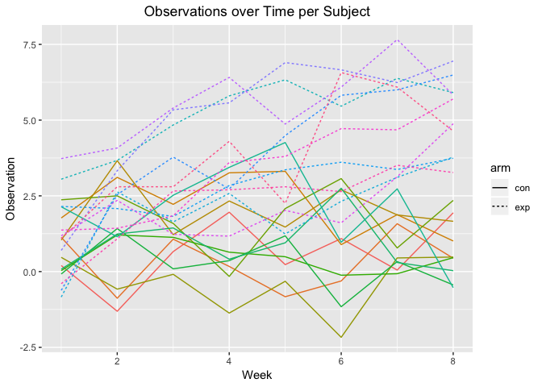

p8105 Homework 5
================
Tory Lynch

##### Problem 1

``` r
#Read in and create tidy table for file names
file_names = list.files(path = "./data", pattern = "*.csv") 

file_names_table = tibble(file_names) %>% 
  unnest() %>% 
  rowid_to_column() %>% 
  mutate(file_names = str_replace(file_names, ".csv", "")) %>% 
  separate(file_names, c("arm", "obs"))
```

``` r
#Read in and create table for observations 
file_list_table = file_names %>% 
  map(function (x){
    read.csv(paste0("./data/", x))
  }) 

file_table = tibble(file_list_table) %>% 
  unnest() %>% 
  rowid_to_column() 
```

``` r
#Tidy table and create plot 
 left_join(file_names_table, file_table) %>% 
  gather(key = week, value = obs, week_1:week_8) %>% 
  mutate(week = as.numeric(str_replace(week, "week_", ""))) %>% 
  mutate(participant = as.factor(rowid)) %>% 
  select(-rowid) %>% 
  ggplot(aes(x = week, y = obs, group = participant, color = participant, linetype = arm)) + 
    geom_line() + 
    labs(
      title = "Observations over Time per Subject", 
      x = "Week", 
      y = "Observation") +
      theme(plot.title = element_text(hjust = 0.5)) +
      scale_colour_discrete(name = "Arm", breaks = c("Exp", "Control"))
```

    ## Joining, by = "rowid"



The participants in the experimental arm all had higher observation values compared to the control arm at the end of the 8-week study period. For the first six weeks of the study, around half of the participants had observation values that were comparable to the high-end of observation values in the control arm; by week 7, there was no overlap between the two arms. Within each arm, however, the participants did not experience constant increases or decreases in observation values. The overall trend in the experimental arm was that the end observation values were higher than at the beginning, but the peak was not necessarily at the end of the study period; observation values peaked between weeks 5 - 7 for some participants. There were no clear trends in the observation values over time for participants in the control arm.

##### Problem 2

``` r
#Read in homicide data
homicide_data = read_csv("homicide-data.csv") %>% 
  mutate(city_state = str_c(city, ", ", state))
```

The Washington Post compiled data on homicides from 50 American cities between 2007 and 2015; the database includes 52,179 rows, each of which represents a victim of homicide, and 12 columns. The name, race, age, and sex of each victim is reported, as well as the location (city, state, latitude, longitude) and report date of the crime. Finally, a disposition variable classifies each crime as closed, with or without an arrest, or open with no arrest.

``` r
#Total number of homicides and number of unsolved homicides per city 
unsolv_hom_table = homicide_data %>% 
  mutate(unsolved_hom = str_detect(disposition, "by")) %>% 
  group_by(city_state) %>% 
  summarise(total_hom = n_distinct(uid), unsolv_hom = sum(unsolved_hom == "FALSE")) %>% 
  rowid_to_column()

unsolv_hom_table %>% 
  knitr::kable()
```

|  rowid| city\_state        |  total\_hom|  unsolv\_hom|
|------:|:-------------------|-----------:|------------:|
|      1| Albuquerque, NM    |         378|          146|
|      2| Atlanta, GA        |         973|          373|
|      3| Baltimore, MD      |        2827|         1825|
|      4| Baton Rouge, LA    |         424|          196|
|      5| Birmingham, AL     |         800|          347|
|      6| Boston, MA         |         614|          310|
|      7| Buffalo, NY        |         521|          319|
|      8| Charlotte, NC      |         687|          206|
|      9| Chicago, IL        |        5535|         4073|
|     10| Cincinnati, OH     |         694|          309|
|     11| Columbus, OH       |        1084|          575|
|     12| Dallas, TX         |        1567|          754|
|     13| Denver, CO         |         312|          169|
|     14| Detroit, MI        |        2519|         1482|
|     15| Durham, NC         |         276|          101|
|     16| Fort Worth, TX     |         549|          255|
|     17| Fresno, CA         |         487|          169|
|     18| Houston, TX        |        2942|         1493|
|     19| Indianapolis, IN   |        1322|          594|
|     20| Jacksonville, FL   |        1168|          597|
|     21| Kansas City, MO    |        1190|          486|
|     22| Las Vegas, NV      |        1381|          572|
|     23| Long Beach, CA     |         378|          156|
|     24| Los Angeles, CA    |        2257|         1106|
|     25| Louisville, KY     |         576|          261|
|     26| Memphis, TN        |        1514|          483|
|     27| Miami, FL          |         744|          450|
|     28| Milwaukee, wI      |        1115|          403|
|     29| Minneapolis, MN    |         366|          187|
|     30| Nashville, TN      |         767|          278|
|     31| New Orleans, LA    |        1434|          930|
|     32| New York, NY       |         627|          243|
|     33| Oakland, CA        |         947|          508|
|     34| Oklahoma City, OK  |         672|          326|
|     35| Omaha, NE          |         409|          169|
|     36| Philadelphia, PA   |        3037|         1360|
|     37| Phoenix, AZ        |         914|          504|
|     38| Pittsburgh, PA     |         631|          337|
|     39| Richmond, VA       |         429|          113|
|     40| Sacramento, CA     |         376|          139|
|     41| San Antonio, TX    |         833|          357|
|     42| San Bernardino, CA |         275|          170|
|     43| San Diego, CA      |         461|          175|
|     44| San Francisco, CA  |         663|          336|
|     45| Savannah, GA       |         246|          115|
|     46| St. Louis, MO      |        1677|          905|
|     47| Stockton, CA       |         444|          266|
|     48| Tampa, FL          |         208|           95|
|     49| Tulsa, AL          |           1|            0|
|     50| Tulsa, OK          |         583|          193|
|     51| Washington, DC     |        1345|          589|

``` r
#Proportion of unsolved homicides in Baltimore, MD 
balt_prop_test = prop.test(x = unsolv_hom_table$unsolv_hom[[3]], n = unsolv_hom_table$total_hom[[3]])
balt_prop_unsolved = broom::tidy(balt_prop_test)
```

In Baltimore, Maryland, 0.6455607 of homicides are unsolved (95% CI:0.6275625, 0.6631599).

``` r
#Proportion of unsolved homicides in all cities 
prop_table_all = unsolv_hom_table %>% 
  select(total_hom, unsolv_hom) %>% 
  mutate(result = map2(unsolv_hom, total_hom, prop.test)) %>% #
  mutate(result = map(result, tidy)) %>% 
  unnest() %>% 
  select(estimate, conf.low, conf.high) %>% 
  rowid_to_column()
```

    ## Warning in .f(.x[[i]], .y[[i]], ...): Chi-squared approximation may be
    ## incorrect

``` r
all_cities_unsolv_prop = unsolv_hom_table %>% 
  left_join(prop_table_all) %>% 
  select(city_state, estimate, conf.low, conf.high) 
all_cities_unsolv_prop %>% 
  knitr::kable()
```

| city\_state        |   estimate|   conf.low|  conf.high|
|:-------------------|----------:|----------:|----------:|
| Albuquerque, NM    |  0.3862434|  0.3372604|  0.4375766|
| Atlanta, GA        |  0.3833505|  0.3528119|  0.4148219|
| Baltimore, MD      |  0.6455607|  0.6275625|  0.6631599|
| Baton Rouge, LA    |  0.4622642|  0.4141987|  0.5110240|
| Birmingham, AL     |  0.4337500|  0.3991889|  0.4689557|
| Boston, MA         |  0.5048860|  0.4646219|  0.5450881|
| Buffalo, NY        |  0.6122841|  0.5687990|  0.6540879|
| Charlotte, NC      |  0.2998544|  0.2660820|  0.3358999|
| Chicago, IL        |  0.7358627|  0.7239959|  0.7473998|
| Cincinnati, OH     |  0.4452450|  0.4079606|  0.4831439|
| Columbus, OH       |  0.5304428|  0.5002167|  0.5604506|
| Dallas, TX         |  0.4811742|  0.4561942|  0.5062475|
| Denver, CO         |  0.5416667|  0.4846098|  0.5976807|
| Detroit, MI        |  0.5883287|  0.5687903|  0.6075953|
| Durham, NC         |  0.3659420|  0.3095874|  0.4260936|
| Fort Worth, TX     |  0.4644809|  0.4222542|  0.5072119|
| Fresno, CA         |  0.3470226|  0.3051013|  0.3913963|
| Houston, TX        |  0.5074779|  0.4892447|  0.5256914|
| Indianapolis, IN   |  0.4493192|  0.4223156|  0.4766207|
| Jacksonville, FL   |  0.5111301|  0.4820460|  0.5401402|
| Kansas City, MO    |  0.4084034|  0.3803996|  0.4370054|
| Las Vegas, NV      |  0.4141926|  0.3881284|  0.4407395|
| Long Beach, CA     |  0.4126984|  0.3629026|  0.4642973|
| Los Angeles, CA    |  0.4900310|  0.4692208|  0.5108754|
| Louisville, KY     |  0.4531250|  0.4120609|  0.4948235|
| Memphis, TN        |  0.3190225|  0.2957047|  0.3432691|
| Miami, FL          |  0.6048387|  0.5685783|  0.6400015|
| Milwaukee, wI      |  0.3614350|  0.3333172|  0.3905194|
| Minneapolis, MN    |  0.5109290|  0.4585150|  0.5631099|
| Nashville, TN      |  0.3624511|  0.3285592|  0.3977401|
| New Orleans, LA    |  0.6485356|  0.6231048|  0.6731615|
| New York, NY       |  0.3875598|  0.3494421|  0.4270755|
| Oakland, CA        |  0.5364308|  0.5040588|  0.5685037|
| Oklahoma City, OK  |  0.4851190|  0.4467861|  0.5236245|
| Omaha, NE          |  0.4132029|  0.3653146|  0.4627477|
| Philadelphia, PA   |  0.4478103|  0.4300380|  0.4657157|
| Phoenix, AZ        |  0.5514223|  0.5184825|  0.5839244|
| Pittsburgh, PA     |  0.5340729|  0.4942706|  0.5734545|
| Richmond, VA       |  0.2634033|  0.2228571|  0.3082658|
| Sacramento, CA     |  0.3696809|  0.3211559|  0.4209131|
| San Antonio, TX    |  0.4285714|  0.3947772|  0.4630331|
| San Bernardino, CA |  0.6181818|  0.5576628|  0.6753422|
| San Diego, CA      |  0.3796095|  0.3354259|  0.4258315|
| San Francisco, CA  |  0.5067873|  0.4680516|  0.5454433|
| Savannah, GA       |  0.4674797|  0.4041252|  0.5318665|
| St. Louis, MO      |  0.5396541|  0.5154369|  0.5636879|
| Stockton, CA       |  0.5990991|  0.5517145|  0.6447418|
| Tampa, FL          |  0.4567308|  0.3881009|  0.5269851|
| Tulsa, AL          |  0.0000000|  0.0000000|  0.9453792|
| Tulsa, OK          |  0.3310463|  0.2932349|  0.3711192|
| Washington, DC     |  0.4379182|  0.4112495|  0.4649455|

``` r
#Plot of proportion of unsolved homicides by city 
all_cities_unsolv_prop %>% 
  mutate(city_state = forcats::fct_reorder(city_state, estimate)) %>% 
  filter(city_state != "Tulsa, AL") %>% #removed because of data entry error - lat/long place this homicide in Tulsa, OK, not Tulsa, AL
  ggplot(aes(x = city_state, y = estimate)) +
  geom_point(alpha = .3) +
  geom_errorbar(aes(ymin = conf.low, ymax = conf.high)) + 
  labs(
    title = "Proportion of Unsolved Homicides in 50 American Cities", 
    x = "City, State", 
    y = "Proportion of Unsolved Homicides (95% CI)") +
  theme(plot.title = element_text(hjust = 0.5)) +
  theme(axis.text.x = element_text(angle = 90))
```


